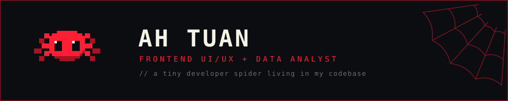
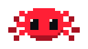
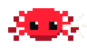
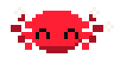
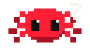
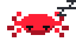

<div align="center">



<br>

<a href="https://github.com/ahtuan171">
  
</a>

<p align="center">
  
</p>

</div>

<br>

---

##  about

I'm **Ah Tuấn (Victor)**, a Computer Science student at the **University of Science, VNU-HCM**, currently exploring the intersection of **software development, data, automation, and AI**.

I'm currently learning **C++, Python, web application development, and data analysis**, while building projects that turn ideas into useful and interactive applications.

My current career direction is **Data Analytics**, while I'm also interested in **UI/UX design and AI automation**.

```text
idea → build → automate → analyze → improve
```

> I like building things, understanding how they work, and finding ways to make them better.

---

##  stack

### Languages


### Frontend


### Backend


### Database


### Tools


---

##  projects

<table>
<tr>
<td width="50%" valign="top">

### 🕷️ Web-Shooter

A browser-based computer vision web application that detects hand gestures in real time.

Strike the classic web-slinging hand pose to shoot a web line in the exact direction you are pointing, complete with an original, hand-drawn spider superhero mask.

**Stack**

`React` `Vite` `MediaPipe` `Computer Vision`

**Highlight**

Real-time hand gesture recognition.

**Status**

`RELEASED`

<br>

<a href="https://github.com/ahtuan171/Web-Shooter">
  
</a>

</td>

<td width="50%" valign="top">

### 🌎 Victor-Tracker

A website designed to help users track their travelling experiences and keep their destinations organized.

The project focuses on making travel history more visual through an interactive global map.

**Stack**

`TypeScript` `Python` `JavaScript` `HTML` `CSS`

**Highlight**

Interactive global map with destination pins.

**Status**

`PROTOTYPE`

<br>

<a href="https://github.com/ahtuan171/Victor-Tracker">
  
</a>

</td>
</tr>

<tr>
<td width="50%" valign="top">

### ✈️ TourXport

A web application that recommends attractions in Vietnam and creates personalized tours based on user requirements.

I worked as the **team leader**, helping coordinate the development of the project.

**Stack**

`Flutter` `Python` `AI`

**Highlight**

AI-generated tour creation through a survey-based experience.

**Status**

`RELEASED`

<br>

<a href="https://github.com/quocnam612/TourXport">
  
</a>

</td>

<td width="50%" valign="top">

### 🔭 More experiments

I enjoy building small projects to explore new technologies, ideas, and workflows.

More experiments, university projects, and prototypes will gradually find their way here.

<br>

<a href="https://github.com/ahtuan171?tab=repositories">
  
</a>

</td>
</tr>
</table>

---

##  numbers

<div align="center">

</div>

<br>

<div align="center">

<a href="https://github.com/ahtuan171">
  
</a>

</div>

---

##  the web i weave

<div align="center">


</div>

---

##  currently working on

**Building and improving projects around web development, automation, and data.**

##  recently shipped

**Web-Shooter — a real-time hand gesture computer vision experience.**

##  currently stuck on

**Figuring out how to turn more ideas into polished, useful products.**

---

##  off the clock

When I'm not coding, you'll probably find me:

· `🏸 Playing badminton`  
· `📚 Reading books`  
· `🏋️ Going to the gym`  
· `🎬 Watching movies`

---

<div align="center">


<br>

<sub>

<a href="https://github.com/ahtuan171">GitHub</a>
  ·   <a href="https://www.linkedin.com/in/tu%E1%BA%A5n-ph%E1%BA%A1m-49a6a4356/?locale=en">LinkedIn</a>

</sub>

<br><br>

<sub>Built with curiosity, caffeine, and a little bit of web-slinging.</sub>

</div>
